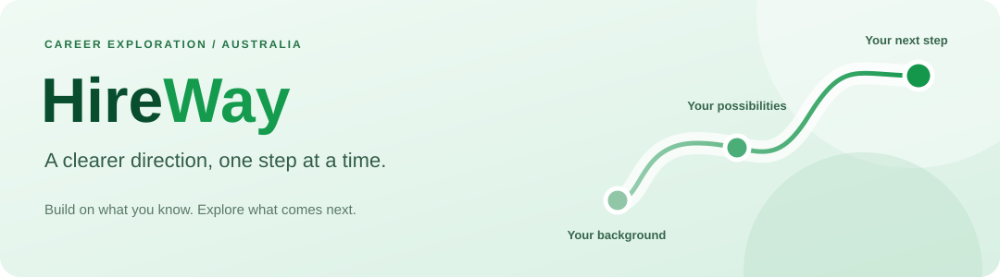
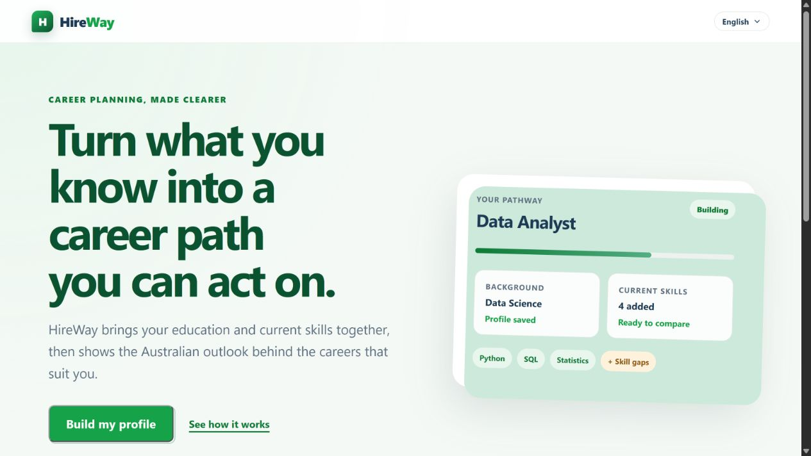

  

<h1 align="center">HireWay</h1>

  <strong>Turn what you know into a career path you can act on.</strong>

  <a href="https://hireway.custard.top"><strong>Explore HireWay ↗</strong></a>
  &nbsp; · &nbsp;
  <a href="#what-is-hireway">About the project</a>
  &nbsp; · &nbsp;
  <a href="#what-you-can-do">What you can do</a>

## What is HireWay?

Choosing a career is easier when you can connect what you already know with what a role actually needs.

HireWay helps students, graduates, and early-career explorers find a direction in the Australian job market. It brings your education and skills together with occupation and labour-market information, so you can explore possibilities and plan your next step.

  

Public homepage captured on 10 October 2026. The pathway card is an illustrative example.

## A clearer direction in three steps

| **01 · Start with you**                                      | **02 · Explore the possibilities**                                   | **03 · Plan your next step**                                              |
| ------------------------------------------------------------ | -------------------------------------------------------------------- | ------------------------------------------------------------------------- |
| Bring together your study background, skills, and strengths. | Discover career matches and understand what different roles involve. | Choose a target role, identify skill gaps, and explore learning pathways. |

## What you can do

- **Discover career options** that connect with your background and current skills.
- **Understand a role** through its day-to-day tasks, required abilities, and useful skills.
- **See the Australian outlook** with employment trends, earnings, and demand information where available.
- **Find what to work on next** by comparing your skills with a target role's requirements.
- **Build a learning pathway** with suggested learning resources and progress tracking.

You can begin without creating an account and return to your profile using your private recovery code.

## The idea behind HireWay

Career information is often scattered across job descriptions, course pages, and labour-market reports. HireWay brings the useful pieces together around one practical question:

> **“Where could I go, and what should I do next?”**

The goal is to help you move from a possible career interest to a clearer, more informed plan.

  <a href="https://hireway.custard.top"><strong>Find your next direction with HireWay ↗</strong></a>

